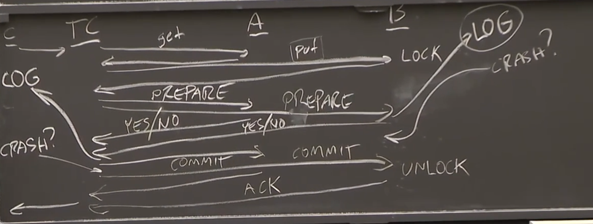
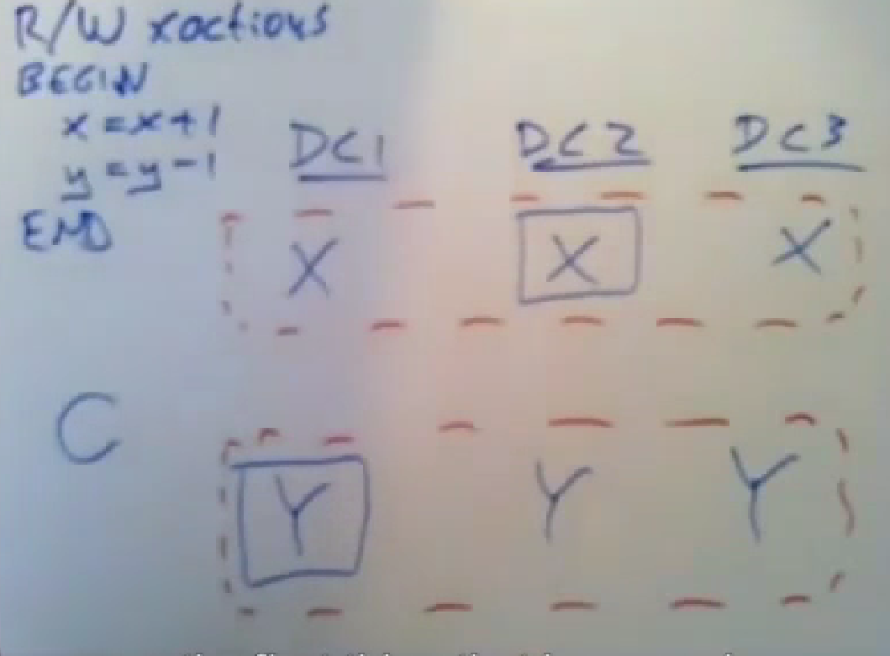
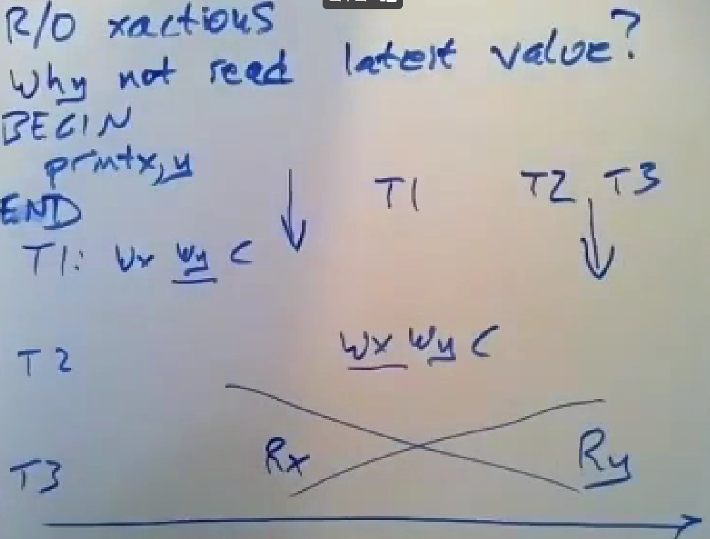

# Distributed Transaction

## 问题

分布式情况下，可能数据在不同的服务器上，同一个txn可能要操作不同的server上的数据。

有可能在部分server上操作成功了，但是部分server因为网络或者自身的原因故障了，导致问题（违反了atomic原则）。

## 悲观atomic commit协议：Two phase commit（两阶段提交）

目的是解决上面提到的问题，即一个事务要不全部完成了，要不就什么也没做。（all-or-none)

### 整体结构

有一个txn coordinator（TC），负责协调事务涉及的各个服务器（参与者）。需要将请求发送给各个参与者，比如将x+=1，将y-=1。

有多个参与者，他们负责执行，他们保存了事务需要处理的数据。在参与者上，保存了事务id获取的lock，方便之后unlock以及检查访问权限。

### 流程

1. TC将事务涉及的各个操作发送给各个参与方，比如get，put等。各个参与方完成后回复请求给TC。
2. 操作完成后，TC给各个参与方发送prepare请求，告知准备commit。
3. 各个参与方收到prepare请求后，**将当前状态或者各种操作以及锁相关信息写入log**，写入完成后给TC回复Yes/No。
4. TC收到各个参与方的回复后，如果不是所有的都是yes，则abort，**否则将当前状态写入log（磁盘）**，然后再给各个参与方发送commit指令。
5. 各个参与方收到commit后，将本地操作commit，并unlock所有锁，然后回复ACK给TC，这个时候各个参与方可以忘记自己上面事务信息。这时commit后所有操作都写入磁盘了，可以释放占用的内存。
6. TC收到所有ack后，将回复发送给Client。

### 考虑Crash

#### 部分参与方fail

1. 某个参与方在第3步之前就fail，即还没有回复prepare的yse，TC就不会进行下一步，就没有server会进行commit，就没有关系。
2. 如果某个参与方在回复prepare的yes后fail了，这时候TC就会进行后面的步骤，其他参与方就会收到commit，就会进行commit和unlock。**所以就需要每个参与方在回复yes之前将当前内存中的状态和保持的lock信息（即提交该事务的所有信息）保存到log（磁盘）中**，这样当该参与者从fail中恢复过来时，仍然能够具备commit的条件。
3. 至于更之后的时间点，都能够利用上一步的log恢复过来，准备commit和unlock。

#### TC fail

1. 如果在给各个参与方发送commit信息之前fail了，没有关系，不需要什么操作，如果参与方来问，就说不知道这个事务的信息，参与方就会把本地关于这个事务的操作abort。
2. **TC需要在发送各个commit信息之前，将事务的信息（结果以及事务id）永久化到log中**，这样当tc在发送几条或者全部commit信息后fail了，也能从磁盘中恢复，知道这个txn已经提交了。然后给所有参与者重新发送commit信息。

### Network Fail

1. TC一直没收到部分参与方对于prepare的回复，它会尝试重新发送，几次之后就可以选择abort这个txn。因为这个时候还没发送任何commit信息，所以可以选择abort。当那个参与方恢复过来来问的时候，TC中可能没有这个事务的信息就，就可以告诉它已经abort了。
2. 如果参与方一直没有收到prepare信息，也可以选择abort这个事务。当TC再询问关于这个事务时，它就直接回复no，TC也会abort这个事务。
3. **当参与方回复了yes，但是一直没收到commit时，这中间的时间则会被block，它会一直持有锁，并且不能自己选择abort，得一直等下去**。（因为回复了yes后，就有其他参与者commit的可能，参与者不能单方面的abort）。大家为减少在这方面等待的时间做了很多努力。

**可能的设计：**每一个server都不只是一个server，而是一个raft集群，然后集群作为一直整体成为参与方。

只有TC才有资格决定abort或者commit，因为它才有全局的信息。但是代价是有可能导致某个参与方一直在等，导致阻塞。

缺点：

1. 要发送大量消息，慢
2. 总是要写入磁盘，慢
3. 参与者可能总是阻塞，慢
4. 参与者可能持有着锁然后还一直阻塞，慢

所以只有一个小规模的服务器集群才会这样用。如果是多个银行之间的，就不会采用，因为不能把自己服务器的运行顺利依赖别人的服务器。

## Spanner

设计时重点关注只读事务，有大量的只读事务和少量的读写事务。

### 整体结构和问题

将数据分片到多个数据中心，每份数据存在多个数据中心中作为备份。对于同一份数据在不同数据中心上，使用Paxos（类似raft）来进行管理。即一份数据在多个server上是一个paxos组，不使用一个paxos组来管理是为了增加并行能力。

设计目的：

1. 数据有多个备份，容错。
2. 每个client能够去读取离自己近的数据中心的replica数据。

要解决的问题：

1. Paxos只需要大多数的log是最新的就行，但是client读本地的，就会读到out-of-date的数据，违反了外部一致性（即一个事务必须能读到在它之前就提交的修改）
2. 一个事务涉及多个数据分片，多个paxos组，所以需要使用分布式事务来进行管理。

### 读写事务

读写事务基本上就是严格的两阶段锁和两阶段提交，然后将两阶段提交的单个server变成paxos组，然后事务协调器（TC）不是单独的，而是选择一个事务涉及的paxos组作为TC，相当于TC也有了容错能力。但是缺点是要通信的消息太多，而且通信彼此之间距离很远。

### 只读事务

要解决的问题：

1. 希望能够优先读本地的/离自己近的replica。但是这样可能不是最新的
2. 不用两阶段提交（慢），也没有用锁。

目标：

1. 可序列化：能够读到之前提交的数据，不能读到任何之后提交的数据。
2. 外部一致性：应该能够看到最新的数据，而不是旧数据

为什么读的数据会出错？

如下图所示，T3读x和y分别在T1结束后和T2结束后，导致他这个事务读取的两个数据不是同一版本的，即不可序列化，T3没法作为一个整体序列化。

#### 解决方法

Snapshot Isolution

和MySql中的MVCC+undo log+read view基本一样。就是各个服务器上有一个sync clock，即同步时钟，各个服务器上的时钟一样。

1. **读写事务在commit时生成TS**，对于修改的值会像undolog一样将旧版本记录下来，并记录下事务对应的TS。
2. **只读事务在start时生成TS**，读请求的时候会附带上TS，找到比自己TS小的最大那个修改记录并读取。
3. 通过这种方式，就能解决上面这种问题，因为读x和读y都得到的是一个时期的读取权限，并不会读到t2修改的那个版本的值。

**但是这样还有一个问题**，就是由于分布式，又是paxos，导致t3读x的时候读不到T1修改的那个x，因为可能读到的是paxos中那个少数没有跟上的版本。

所以增加了一个safe time的概念。T3的读请求会附加当前的TS，而如果这个请求到达的这个replica从leader获取的最新的记录的TS小于这个读请求的TS，他就会延迟回复，等到自己的从leader获取的最新记录大于该TS后再回复。

**另一个问题是，这中方式依赖Time Sync，但是很难确保实现不同机器上的时钟完全一致。**

解决方式：

1. 每个事务在生成TS时，都是从时间服务器上获取一个时间区间（earlist，latest），都会选择latest作为自己的TS。这样就能保证各个服务器一致，因为都选的最晚的。
2. **Commit Delay：对于读写事务，他会延迟commit，直到自己选择的那个TS不再在当前区间里，就能保证这个事务commit之后的读事务生成的TS一定比这个TS大，就能保证后面读的事务能读到自己的修改。**

